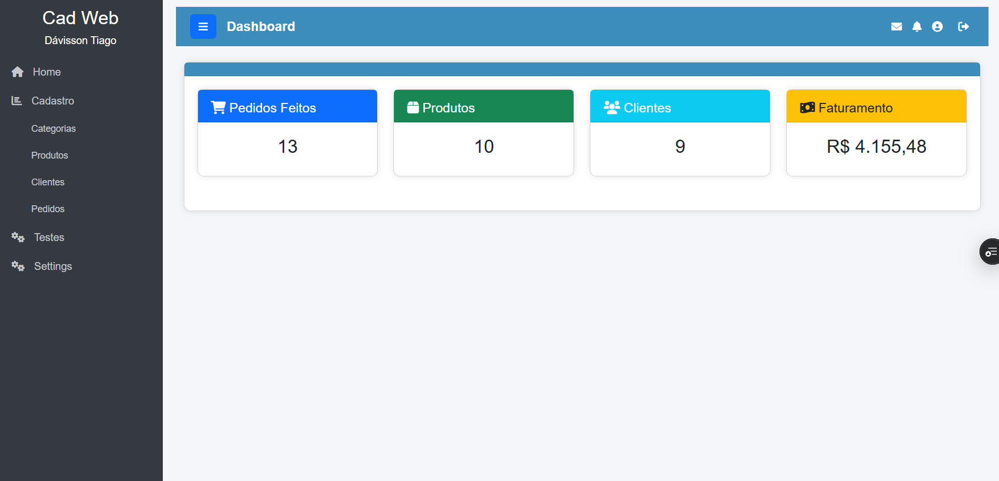
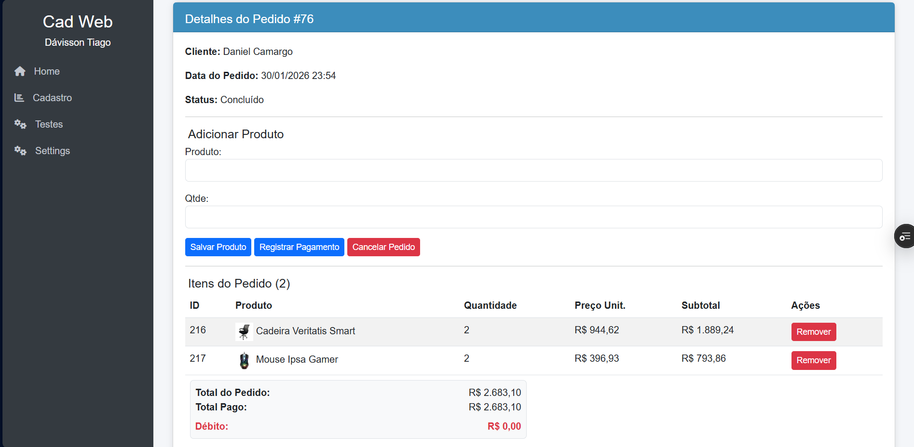

# 🛒 E-commerce PWeb (Academic Project)

> Projeto final da disciplina de Programação Web: Um sistema de e-commerce completo focado em arquitetura MTV, gestão de sessões e segurança.

  

## 🧠 Sobre o Projeto

Este projeto simula uma loja virtual completa, desde a vitrine de produtos até à emissão da nota fiscal. O foco principal não foi apenas o CRUD, mas a implementação de conceitos avançados como **Middlewares de Segurança**, **Gestão de Carrinho via Sessão** e deploy em arquitetura **Serverless (Vercel)**.

### ⚡ Diferenciais Técnicos

* **🛡️ Sistema de Auditoria (Security Logs):** Implementação de Middlewares personalizados (`home/middleware.py`) que interceptam requisições para:
    * **HackerLog:** Deteta e registra tentativas de injeção ou acesso indevido.
    * **RegistroAcesso:** Mantém um histórico detalhado de quem acessou o quê.
* **🛒 Carrinho de Compras (Session-Based):** Lógica manual de carrinho de compras sem uso de bibliotecas externas, manipulando diretamente a sessão do utilizador.
* **📦 Seed Database:** Comando personalizado para popular o banco de dados com categorias e produtos de teste num único passo.

## ✨ Funcionalidades

* **Vitrine Dinâmica:** Filtragem de produtos por categorias.
* **Fluxo de Compra:** Adicionar ao carrinho -> Identificação -> Pagamento -> Pedido.
* **Área do Cliente:** Histórico de pedidos e visualização de Notas Fiscais (HTML).
* **Painel Administrativo:** Gestão completa via Django Admin.
* **Easter Eggs:** Páginas secretas escondidas na aplicação. 🐰

## 🛠️ Tecnologias Utilizadas

* **Backend:** Python 3, Django 4.2.7
* **Frontend:** Django Templates, HTML5, CSS3 (Estilização personalizada).
* **Banco de Dados:** SQLite (Desenvolvimento).
* **Infraestrutura:** Vercel (Configurado via `vercel.json`), Whitenoise (Static Files).

## 🚀 Como Executar Localmente

1. **Clone o repositório**
   ```bash
   git clone [https://github.com/davissontiago/pweb-djangofinal.git](https://github.com/davissontiago/pweb-djangofinal.git)
   cd pweb-djangofinal
2. **Crie o ambiente virtual e instale as dependências**

    ```bash
    python -m venv venv
    # Ative o ambiente (Windows: venv\Scripts\activate | Linux: source venv/bin/activate)
    pip install -r requirements.txt
3. **Configure o Banco de Dados**

    ```bash
    python manage.py migrate

4. ***Popule o Banco (Opcional) Este comando cria categorias e produtos fictícios automaticamente:***

    ```bash
    python manage.py popular_banco

5. ***Inicie o Servidor***

    ```bash
    python manage.py runserver

Acesse: http://127.0.0.1:8000/

## 📂 Estrutura do Projeto

* **home/:** App principal contendo toda a lógica de negócio.

* **middleware.py:** Lógica de segurança e logs.

* **management/commands/:** Scripts de automação.

* **views.py:** Controladores das páginas (Vitrine, Checkout, Login).

* **pweb/:** Configurações globais do projeto (Settings, WSGI, URLS).

* **templates/:** Arquivos HTML organizados por módulos (Produto, Pedido, Cliente).

* **static/:** Arquivos CSS e JavaScript (scripts de menu e funções auxiliares).

## 📸 Screenshots





## Desenvolvido por Dávisson Tiago 👨‍💻 Licenciatura em Computação - IFPI